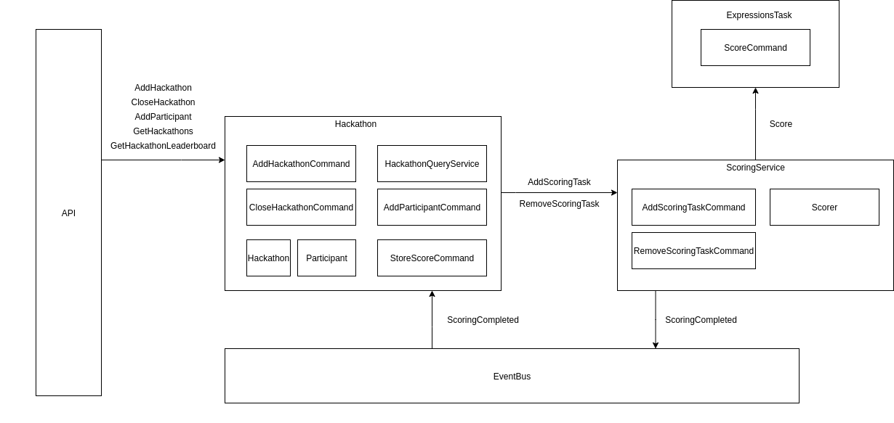
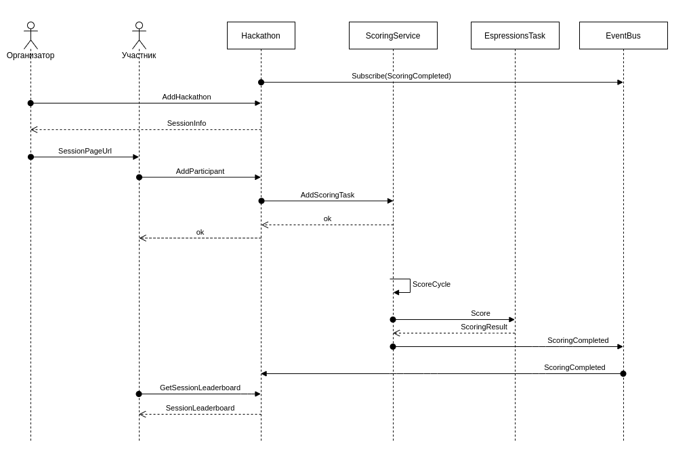

# Сервис для проведения хакатонов

## Идея
Сервис позволяет организовывать хакатоны, каждый хакатон это Сессиея(Session) в рамках которой все происходит. Участники хакатона(Participant) могут добавить адреса своих проектов. После добавления проекты будут переодически тестироваться в соответствии с сконфигурированными тестами.

## Варианты использования

## Компоненты

## Последовательность проведения хакатона
